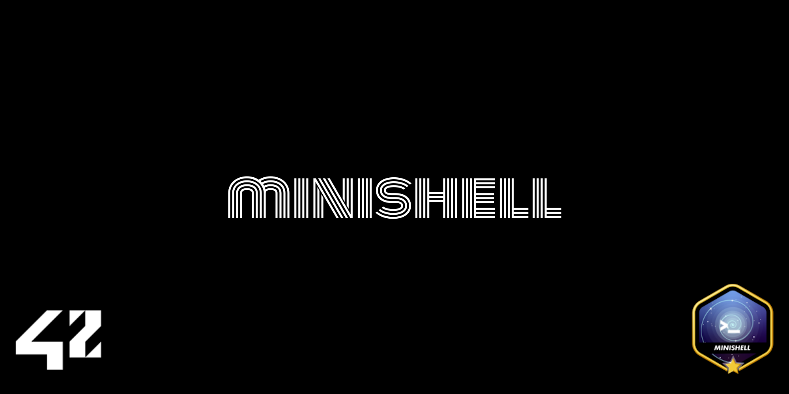

<div align="center">
<h1>42 - MiniShell</h1>



</br>
</br>


TEST DE PR

<strong>MINI SHELL 📡</strong>

<p>Descrition breve du projket</p>

</br>

<p><a href="https://github.com/MathysCogne/42_MiniShell/blob/main/subject/en.subject.pdf"><strong>Subject</strong></a></p>


</div>


# Notion:
<p><a href="https://www.notion.so/mathys-cogne/MINISHELL-15a8a46a9e65808283a7f71b9cf2d3b0"><strong>Link Notion</strong></a></p>

## Features


</div>

</br>

## Compilation and Usage

</br>

```bash
# Compile:
make

# Start shell:
./minishell

```

</br>

## Disclaimer
> At 42 School, most projects must comply with the [Norm](https://github.com/42School/norminette/blob/master/pdf/en.norm.pdf).
